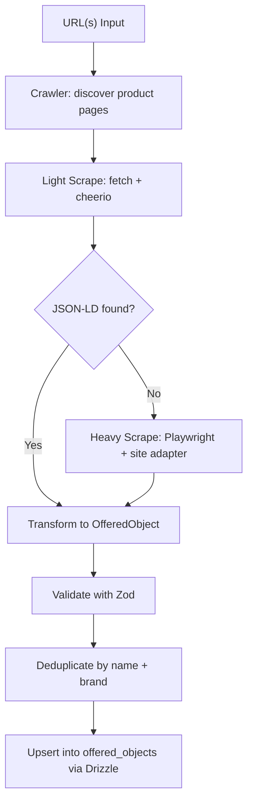
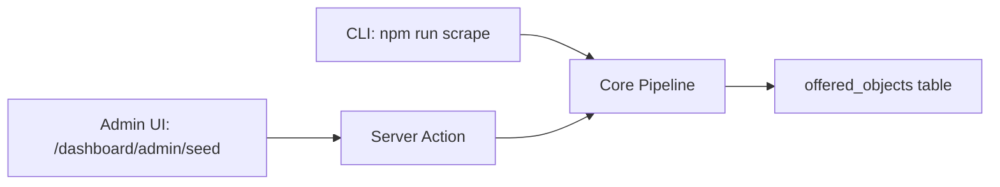
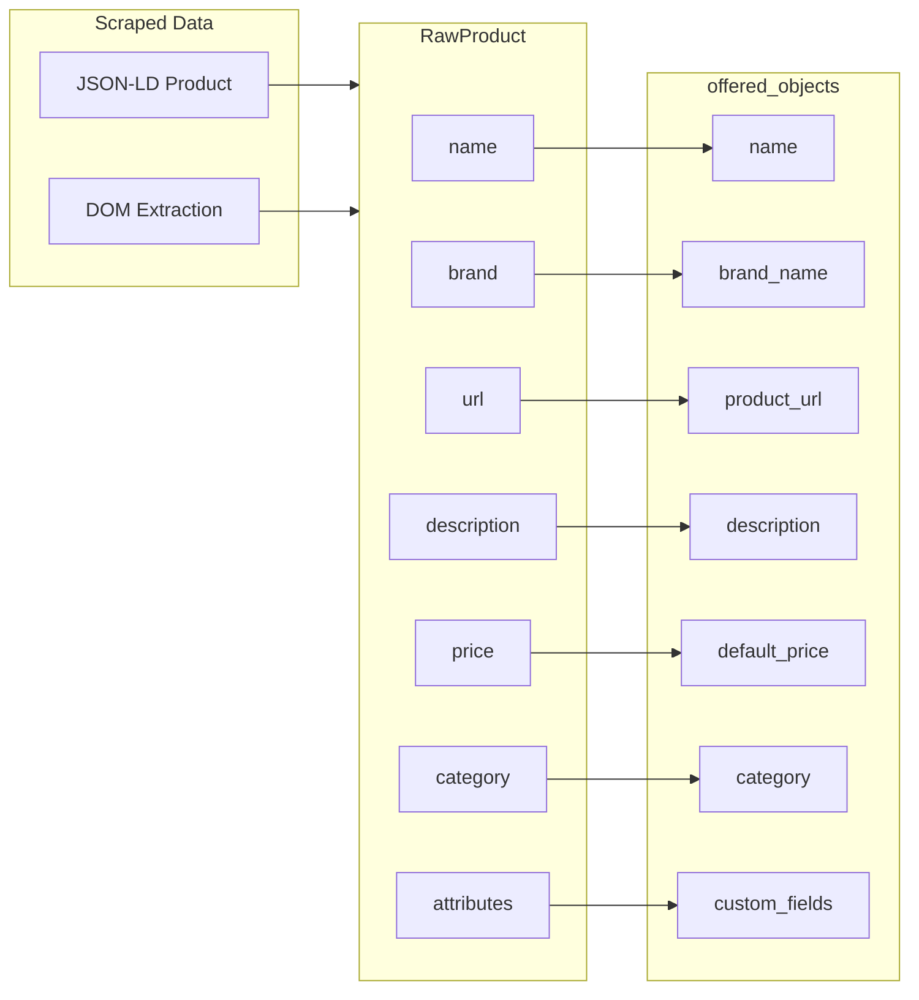

# Seed Pipeline for Offered Objects

A hybrid scraping pipeline that extracts real-world product data from websites and seeds the `offered_objects` table in the Objects app database.

## Architecture

### Scraping Flow



### Entry Points



### Data Mapping



## How It Works

### Two-Layer Scraping Strategy

**Layer 1 - Light Scraper (JSON-LD extraction)**

The primary extraction method. Most major retailers (Amazon, Best Buy, Target, IKEA, Apple, etc.) embed [Schema.org Product](https://schema.org/Product) structured data in their HTML as `<script type="application/ld+json">` tags. This data is standardized, reliable, and far less fragile than DOM scraping.

Example JSON-LD found on a product page:

```json
{
  "@type": "Product",
  "name": "AirPods Pro 2",
  "brand": { "@type": "Brand", "name": "Apple" },
  "description": "Active Noise Cancellation...",
  "url": "https://apple.com/airpods-pro",
  "offers": { "@type": "Offer", "price": "249.00" },
  "category": "Electronics > Headphones"
}
```

**Layer 2 - Heavy Scraper (Playwright + DOM adapters)**

Fallback for sites that require JavaScript rendering or don't include JSON-LD. Uses Playwright to render the page in a real browser, then runs a site adapter to extract product data from the DOM using CSS selectors.

Each site adapter implements the `SiteAdapter` interface:

```typescript
interface SiteAdapter {
  name: string;
  matchesUrl: (url: string) => boolean;
  extractProducts: (page: Page) => Promise<RawProduct[]>;
  getProductLinks?: (page: Page) => Promise<string[]>;
}
```

A built-in `generic` adapter handles most sites using common patterns (h1 for title, meta tags, price selectors, etc.). Site-specific adapters can be added for unusual layouts.

### Pipeline Stages

1. **Input** - Accept URL(s) from CLI args, a file, or the admin UI
2. **Crawl** (optional) - If `--crawl` is set, discover product links from listing pages
3. **Scrape** - For each product URL, try JSON-LD first, fall back to Playwright + adapter
4. **Transform** - Map raw scraped data to the `NewOfferedObject` schema
5. **Validate** - Run through Zod schema, reject entries missing required fields
6. **Deduplicate** - Skip products that already exist (matched by name + brand_name)
7. **Insert** - Upsert into the `offered_objects` table via Drizzle ORM

## File Structure

```
seed-pipeline/
├── README.md               # This file
├── package.json            # Dependencies
├── tsconfig.json           # TypeScript config
└── src/
    ├── index.ts            # CLI entry point
    ├── pipeline.ts         # Core orchestrator
    ├── scraper/
    │   ├── light.ts        # fetch + cheerio JSON-LD extraction
    │   └── heavy.ts        # Playwright DOM extraction
    ├── adapters/
    │   ├── types.ts        # SiteAdapter interface, RawProduct type
    │   └── generic.ts      # Generic adapter for most sites
    ├── transformer.ts      # RawProduct -> NewOfferedObject
    ├── validator.ts        # Zod validation
    ├── db.ts               # Database upsert via Drizzle
    └── utils.ts            # Helpers (rate limiting, logging, URL utils)
```

## Usage

### CLI

```bash
cd seed-pipeline

# Scrape a single product page
npm run scrape -- --url "https://apple.com/airpods-pro"

# Scrape all products from a listing page (follows product links)
npm run scrape -- --url "https://example.com/products" --crawl

# Scrape from a list of URLs in a file
npm run scrape -- --file urls.txt

# Dry run (preview what would be inserted, no DB writes)
npm run scrape -- --url "https://example.com/product" --dry-run

# Specify concurrency and delay
npm run scrape -- --url "https://example.com/products" --crawl --concurrency 5 --delay 2000
```

### Admin UI

Navigate to `/dashboard/admin/seed` in the app. Paste one or more URLs (one per line), click "Scrape", and see results.

## Target Schema

The pipeline inserts into the `offered_objects` table:

| Column | Type | Source |
|--------|------|--------|
| `name` | TEXT (required) | Product name from JSON-LD or DOM |
| `brand_name` | TEXT | Brand from structured data or DOM |
| `product_url` | TEXT | Canonical URL of the product page |
| `category` | TEXT | Category from breadcrumbs or structured data |
| `description` | TEXT | Product description (truncated to 500 chars) |
| `default_price` | NUMERIC(10,2) | Price from offers or DOM |
| `custom_fields` | JSONB | Extra attributes: color, size, SKU, etc. |
| `is_active` | BOOLEAN | Always `true` on insert |

## Rate Limiting and Politeness

- Configurable delay between requests (default: 1500ms)
- Concurrency limit (default: 3 simultaneous pages)
- User-Agent header identifies the scraper
- Optional `robots.txt` checking

## FAQ

### Why JSON-LD first instead of just scraping the DOM?

JSON-LD structured data follows the Schema.org standard. It is embedded by most major retailers specifically for search engines and is far more stable than DOM selectors, which change with every site redesign. Extracting JSON-LD is also much faster since it only requires an HTTP fetch and HTML parsing -- no browser rendering needed.

### Which websites support JSON-LD Product data?

Most large e-commerce sites including Amazon, Best Buy, Target, Walmart, IKEA, Apple, Home Depot, Wayfair, Nike, and many others. You can check any page by viewing its source and searching for `application/ld+json`.

### What happens if a site has no JSON-LD?

The pipeline falls back to the heavy scraper, which uses Playwright to render the page in a real Chromium browser. It then runs a site adapter (generic or site-specific) that extracts data using CSS selectors and common DOM patterns.

### How does deduplication work?

Before inserting, the pipeline checks if a record with the same `name` and `brand_name` already exists in `offered_objects`. If it does, the record is skipped. This makes it safe to re-run the pipeline on the same URLs without creating duplicates.

### Can I add a custom adapter for a specific website?

Yes. Create a new file in `src/adapters/` that implements the `SiteAdapter` interface. The `matchesUrl` method determines which URLs your adapter handles. Register it in the adapter list and it will be used automatically for matching URLs.

### How does the crawl mode work?

When `--crawl` is passed, the pipeline first visits the given URL as a listing page and discovers product links. The generic adapter looks for common patterns: product grids, card links, and pagination. It collects all product URLs, deduplicates them, and then scrapes each one through the normal pipeline.

### Is this pipeline separate from the main app?

Yes. `seed-pipeline/` is a standalone Node.js package with its own `package.json` and dependencies. It connects directly to the same PostgreSQL database using the `DATABASE_URL` environment variable. The admin UI in the main app calls the same core logic via a server action.

### What about images?

Phase 1 does not download or store product images. The pipeline extracts the product URL, which typically leads to a page with images. Future phases may add image downloading and upload to Supabase Storage.

### Can I import from CSV or JSON datasets instead of scraping?

Not yet, but the pipeline architecture supports this. A dataset importer would simply produce `RawProduct` objects and feed them into the same transform -> validate -> insert stages. This is planned for a future phase.

### How do I handle sites that block scrapers?

Some sites use anti-bot measures (CAPTCHAs, rate limiting, IP blocking). The heavy scraper uses a real Chromium browser via Playwright, which helps avoid basic bot detection. For aggressive blocking, consider:
- Increasing the delay between requests
- Using rotating proxies (not built in, but can be configured in Playwright)
- Using the site's official API if one exists
- Respecting `robots.txt` and terms of service

## Roadmap

- [x] Phase 1: Light scraper (JSON-LD) + generic DOM adapter + CLI + admin UI
- [ ] Phase 2: Site-specific adapters for popular sites
- [ ] Phase 3: Image downloading and Supabase Storage upload
- [ ] Phase 4: Open dataset importers (CSV/JSON bulk import)
- [ ] Phase 5: Scheduled scraping via cron or background jobs
